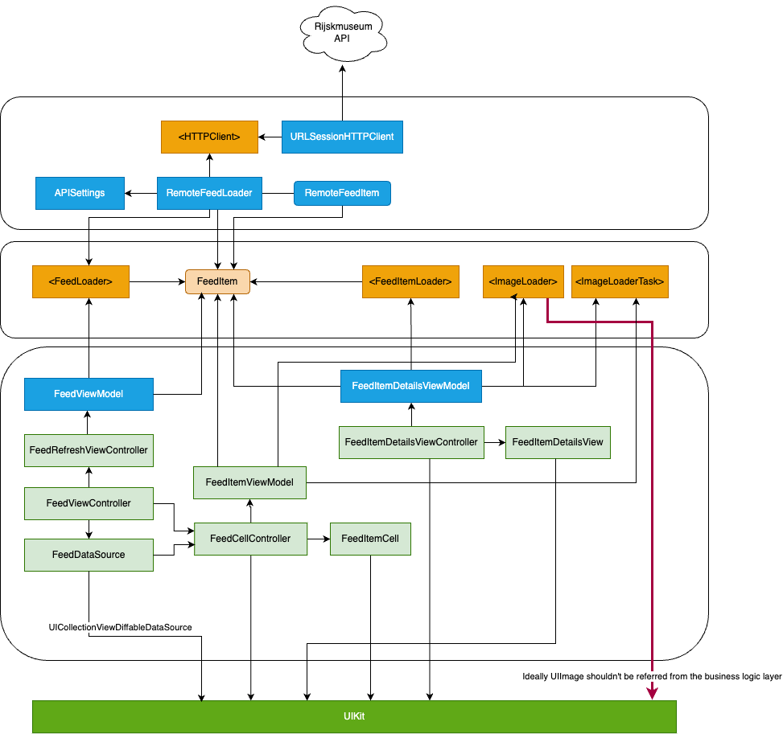

# Potential improvements if I had all time in the world

1. Decouple `FeedItemViewModel` from UIKit providing better reusability for other platforms like WatchOS. `ImageLoader` interface now operates with `UIImage` as I decided to cut this corner for the sake of a pragmatic approach. 
2. API key could be extracted at least to the .xcconfig file so it is not leaked to Github.
3. There is some code in `RemoteFeedLoader` and `RemoteFeedItemLoader` that is very similar and could be generalized. It would not be a problem if i decided to use any of popular networking libabries. I deliberately didn't use any of them.
4. There are no tests for the UI part of the feed item details screen. It is pretty much similar to the main feed. Hopefully main feed screen code coverage is enough (95%).
5. I faced a few challenges I didn't expect because of lack of real-world experience working with public APIs and not using `UICollectionView` for the last 5 years. I didn't expect API to blow up the app with a big-sized images so I had to implement both caching and resizing. The latter was then replaced by utilizing iOS 15 API `UIImage.prepareThumbnail` whis is neat and basically allows to mitigate most of the `UICollectionView` performance issues with one line of code. I take very assignment as a learning opportunity so I dived deep into both compositional layout and diffable data source. All in all it took a lot of time I didn't expect to spend. If I would be working on a real project I would be much more careful and avoiding to work on a few new things simultaneously. I also used TDD which I am uset to, but it of course also added a bit to the time spent working on the assignment.
6. `ImageCache` is not thread-safe. Could be done using dispatch queue with barriers on write
7. Header section configuration is quite simple and is done in `FeedViewController`. It could be extracted to its own module in case of complexity increase.
8. There is a syncroniation bug that can be reproduced by fast scrolling, images are out of sync with cells.

# Dependencies diagram

